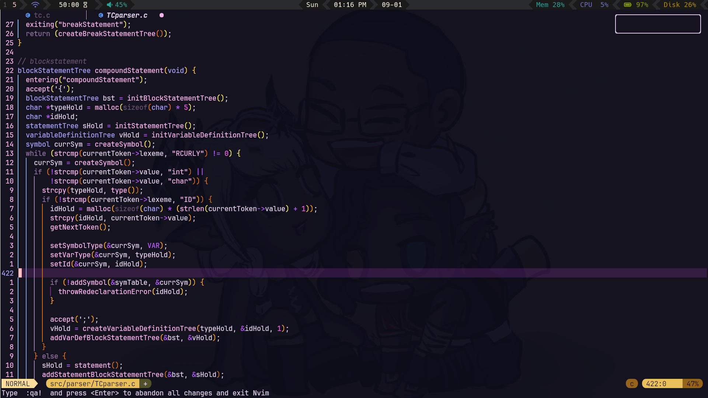

# lillilac.nvim

A lilac inspired neovim theme



## Installation

For Lazy add the following to your plugins.lua file or return it in its own file. 

```lua
{
	"love-pengy/lillilac.nvim",
	opts = { lazy = true },
	config = function(opts)
		vim.cmd.colorscheme("lillilac")
	end,
}
```

For other package managers follow your normal configuration method
